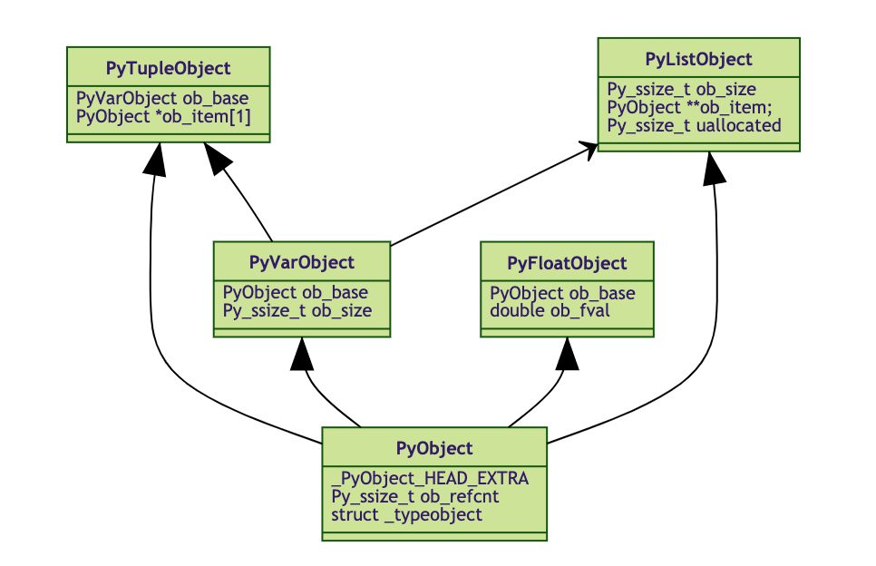

# Garbage Collection: Algorithms and implementations

My solution about "Garbage Collection: Algorithms and implementations"

# Todo List

- [ ] Python GC

# アルゴリズム編

**GCの根本**

- マークスイープGC
- 参照カウント
- コピーGC


# 実装編

色々なGCの仕組みを解析し、実装している。

## PythonのGC

**Python：**

 - コア：Cで書いてる
 - ライブラリ：Pythonで書いてる

**ディレクトリ構成（GC関連）：**

|ディレクトリ|概要|
|:--:|--:|
|Python|Pythonのコア|
|Modules|PythonのC拡張モジュール|
|Include|Pythonをコンパイルする際に参照する各種ヘッダーファイル|
|Objects|Pythonのオブジェクト用のCコード|

**PythonのGCアルゴリズム**

- 参照カウント

**Pythonのオブジェクト管理**

  


**Pythonのメモリアロケータ**

- メモリ構造

|Sequence Number| Function| API|
|:--:|:--:|:--:|
|3|オブジェクト特有のメモリアロケータ|```PyDict_New()```|
|2|Pythonオブジェクトアロケータ|```PyObject_GC_New()```, ```PyObject_Malloc()```|
|1|Python低レベルメモリアロケータ|```new_arena()```|
|0|汎用的な基礎アロケータ|```malloc()```|
|-1|OS特有の仮想メモリマネージャ|-|
|-2|物理メモリ・スワップ先（HDDなど）|-|


# Reference

- 「がベージコレクションのアルゴリズムと実装」(Garbage Collection: Algorithms and implementations), 中村成洋・相川光